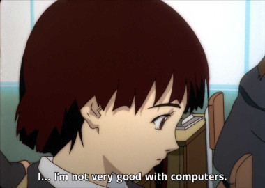
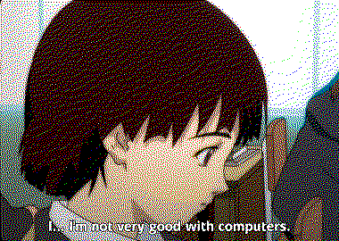

# Jole's dither implementation

jd-rs will dither images according to a palette (or the default one). It will
read fardbeld images from stdin, and then write the result to stdout. See the
test for an example.

